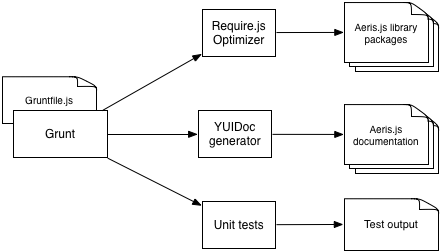

# Building and Deploying Aeris.js

* [Overview](#overview)
* [Preparing Your Build Environment](#preparing-your-build-environment)
* [Building Aeris.js](#building-aerisjs-a-step-by-step-guide)
* [Deploying Aeris.js](#deploying-aerisjs-a-step-by-step-guide)
* [Custom Builds](#custom-builds)
* [Choosing a Version Number](#choosing-a-version-number)
* [Understanding the Build Process](#understanding-the-build-process)
  * [Grunt Task Runner](#grunt-task-runner)
  * [Travis-CI](#travis-ci)

## Overview

An Aeris.js **build** involves the following steps:

* **Test** and **lint** the library code
* **Package AMD modules** into a single library file
* Generate **documentation**
 
A **deployment** includes additional steps:

* Update the library **version**
* Copy library and documentation files to **AWS** server

Most of these tasks are automated using [Grunt](http://gruntjs.com/) and [Travis-CI](https://travis-ci.org/hamweather/aerisjs).


## Preparing Your Build Environment

Build tasks are automated using the [Grunt](http://gruntjs.com/) javascript task runner. To use grunt, you will need to have [Node.js installed](http://nodejs.org/download/) on your system.

A number Node.js packages are used to assist in the build process. These dependencies are defined in [package.json](../package.json), and can be installed using:

```
$ sudo npm install
```
*note: all commands should be run from the aerisjs repo base directory, unless otherwise noted*

Some grunt tasks need to use a global version of [RequireJS](http://requirejs.org/) and [YUIDoc](http://yui.github.io/yuidoc/). These packages can be installed using `npm` with the `-g` flag:

```
$ sudo npm install -g requirejs
$ sudo npm install -g yuidocjs
```


## Building Aeris.js: A Step-by-Step Guide 


**Step 1**: Run `$ grunt build`

That was easy.

You will find built library files and generated documentation in the `build/` directory. Note that any **failing tests or build errors will cause the build to break** and no files will be written.

If you're running into errors, you can try running grunt with the `--verbose` flag. Also note that test spec runners are saved to the `tests/` directory, and can be run and debugged in a browser.


## Deploying Aeris.js: A Step-by-Step guide

Deploying Aeris.js requires a few more steps than running a local build. The deployment process outlined below is adapted from the [gitflow](http://nvie.com/posts/a-successful-git-branching-model/) git workflow.
Note that only repo administrators may run deployments.

1. **Merge** any commits you wish to include in the release into `master`.
1. **Checkout** a local branch off of master called `Release/vX.x.x`. See [*Choosing a Version Number*](#choosing-a-version-number) for guidelines on versioning your release.
1. Update the **version** number in [`package.json`](../package.json) (or use the `$ grunt version:aeris:X.x.x` command)
1. Update the [**changelog**](../CHANGELOG.md) file with a summary of changes since the last release.
1. **Build** the library using `$ grunt build`. Fix any failed specs or build errors before continuing.
1. **Commit** your changes
1. **Merge** your `Release/vX.x.x` branch into `master`, and checkout master
1. **Tag** the release: `$ git tag vX.x.x`
1. **Push** your `master` branch to `hamweather/aerisjs`
1. **Push your tags** to `hamweather/aerisjs` (`$ git push origin --tags`)
1. **Merge** any changes made on `master` back into your `dev` and `Feature/` branches

As soon as your `master` branch is pushed to github, Travis-CI will run it's own build scripts, and, if everything passes, will deploy the library and documentation. You can watch the Travis scripts run at [travis-ci.org/hamweather/aerisjs](https://travis-ci.org/hamweather/aerisjs).

See [Understanding the Build Process](#understanding-the-build-process) for more information on how this all works.


## Custom Builds

The Aeris.js build process creates a number of different build packages, which each include a different subset of Aeris.js library features. Custom builds can be configured from the [Gruntfile.js](../Grunfile.js) Grunt configuration.

Here is an example build config:

```javascript
// Gruntfile.js
grunt.initConfig({
  // ...
    requirejs: {
      // ...
      'gmaps-plus': {
        // The createRjsConfig method uses a base config
        // defined in deployment/config/base-lib.js
        options: createRjsConfig('gmaps-plus', {
        
          // List any AMD modules which you wish to 
          // include in your build.
          packages: [
            'aeris/packages/maps',
            'aeris/packages/gmaps',
            'aeris/packages/api',
            'aeris/packages/geoservice'
          ],
          
          // Map rendering strategy
          strategy: 'gmaps',
          
          // Build output directory.
          outDir: '<%=buildDirs.lib %>/myCustomBuild',
          
          minify: false
        })
      }
    }
  // ...
});
```

All build configurations listed under `requirejs` will be included in Aeris.js builds and deployment.


## Choosing a Version Number

Aeris.js follows [semver](http://semver.org/) semantic versioning. It's worth reading the spec, but here's a basic outline:

* A **major version** bump (v1.0.0 --> v2.0.0) must be made for any backward incompatible changes to the library interface. This should be a rare occassion, as it means introducing breaking changes to developers' code.
* A **minor version** bump (v1.0.0 --> v1.1.0) should be made for any significant additions to the library. This would include new features and functionality.
* A **patch** bump (v1.0.0 --> v1.0.1) can be used whenever there are minor changes to code which do not change the library interface (eg. bug fixes).

While Aeris.js is in beta, we are using a major version of 0.x.x, and are not enforcing major version bumps for interface-breaking changes.


## Understanding the build process

### Grunt Task Runner



The build process consists of a series of *tasks* which must be run in order to prepare the Aeris.js library for deployment. These tasks include:

* **Optimizing** the library using the [RequireJS Optimizer](http://requirejs.org/docs/optimization.html)
* Generating [YUIDoc](http://yui.github.io/yuidoc/) **documentation**
* Compiling [Compass](http://compass-style.org/) **stylesheets**
* **Moving generated files** to the `build` directory
* Running unit **tests** and code quality tools
* Updating the library **version** number

Rather than running all of these tasks by hand for every build, we use the [Grunt](http://gruntjs.com/) task runner to configure the build process. Grunt tasks are defined in [Gruntfile.js](../Gruntfile.js). This sample shows a Grunt  configuration to compile the API documentation stylesheet:

```javascript
grunt.initConfig({
  // ...
  compass: {
    'api-docs': {
      options: {
        cssDir: 'docs/assets/css',
        sassDir: 'docs/themes/api/scss',
        imagesDir: 'docs/assets/images',
        fontsDir: 'docs/assets/fonts',
        javascriptsDir: 'docs/assets/js',
        relativeAssets: true,
        importPath: 'docs/themes/public/scss',
        force: true
      }
    }
  }
  // ...
});
```

Tasks can then be composed using any number of subtasks:

```javascript
grunt.registerTask('build', [
  'test',
  'requirejs',
  'compass',
  'shell:generateDocs'
]);
```

This registers a task to test the library, run the requirejs optimizer, compile compass stylesheets, and generate documentation. To run this task, we simply call it from the command line:

```javacript
$ grunt build
```


### Travis-CI


[Travis-CI](http://docs.travis-ci.com/) allows us to further automate the build process, by registering [git hooks](http://githooks.com/) on the [Aeris.js github repo](https://github.com/hamweather/aerisjs). A git hook is simply a script which is run any time something happens within a git repository. In our case, Travis CI registers a hook to run a build script whenever a commit is pushed to the Aeris.js Github repo.


The build script run by Travis-CI is configured in [.travis.yml](../.travis.yml). Our configuration tells Travis to:

* Spin up a virtual machine running Node.js
* Install node packages (including Grunt, and other build tools)
* Install [Bower](http://bower.io/) packages (Aeris.js library dependencies)
* Run our Grunt build tasks
* Deploy files in the `build/` directory (if we're on the master branch, only)


The [.travis.yml](../.travis.yml) configruation allows us to run commands at various points in the [build process lifecycle](http://docs.travis-ci.com/user/build-lifecycle/).

```
# .travis.yml
# ...
install:
- npm install
before_script:
- npm run-script bower
script:
- npm run-script travis
```

The above configuration tells travis to install node packages, then install bower packages, then run the npm `travis` script (Which in turn runs a grunt task. You can find npm script definitions in [package.json](../package.json) under "scripts").

If all of our build scripts pass, Travis-CI will deploy to an AWS S3 bucket. Credentials for the AWS cli are stored in an encrypted environment variable, which can only be used with the hamweather/aerisjs repo:

```
# .travis.yml
# ...
env:
  global:
    secure: abcdefg1234567abcdefg1234567abcdefg1234567abcdefg1234567
```

You can watch Travis build scripts run from the [Travis-CI](https://travis-ci.org/hamweather/aerisjs) console.
